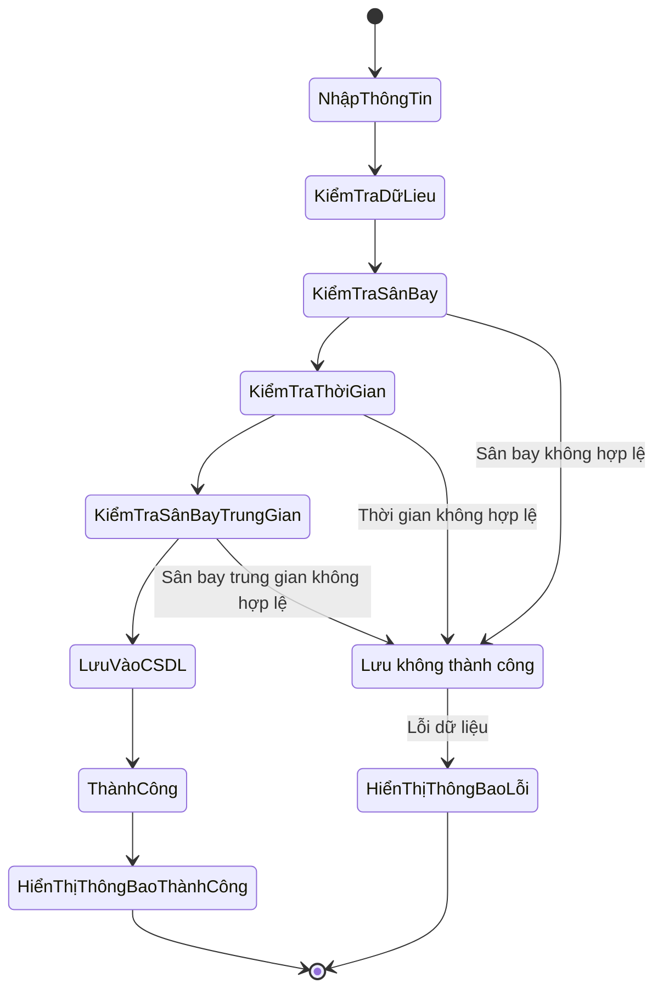

```mermaid
stateDiagram-v2
    [*] --> NhậpThôngTin
    NhậpThôngTin --> KiểmTraDữLieu
    KiểmTraDữLieu --> KiểmTraSânBay
    KiểmTraSânBay --> KiểmTraThờiGian
    KiểmTraThờiGian --> KiểmTraSânBayTrungGian
    KiểmTraSânBayTrungGian --> LưuVàoCSDL
    LưuVàoCSDL --> ThànhCông
    ThànhCông --> HiểnThịThôngBaoThànhCông
    HiểnThịThôngBaoThànhCông --> [*]

    LưuVaoCSDL_KhongHopLe: Lưu không thành công
    KiểmTraSânBay --> LưuVaoCSDL_KhongHopLe: Sân bay không hợp lệ
    KiểmTraThờiGian --> LưuVaoCSDL_KhongHopLe: Thời gian không hợp lệ
    KiểmTraSânBayTrungGian --> LưuVaoCSDL_KhongHopLe: Sân bay trung gian không hợp lệ

    LưuVaoCSDL_KhongHopLe --> HiểnThịThôngBaoLỗi: Lỗi dữ liệu
    HiểnThịThôngBaoLỗi --> [*]
```