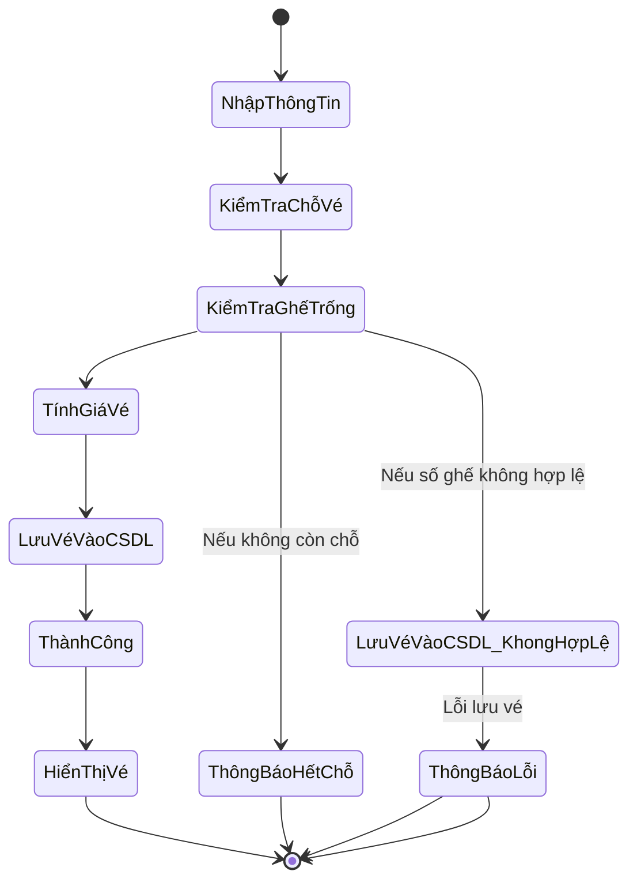

```mermaid
stateDiagram-v2
    [*] --> NhậpThôngTin
    NhậpThôngTin --> KiểmTraChỗVé
    KiểmTraChỗVé --> KiểmTraGhếTrống
    KiểmTraGhếTrống --> TínhGiáVé
    KiểmTraGhếTrống --> ThôngBáoHếtChỗ: Nếu không còn chỗ
    TínhGiáVé --> LưuVéVàoCSDL
    LưuVéVàoCSDL --> ThànhCông
    ThànhCông --> HiểnThịVé
    HiểnThịVé --> [*]

    KiểmTraGhếTrống --> LưuVéVàoCSDL_KhongHợpLệ: Nếu số ghế không hợp lệ

    LưuVéVàoCSDL_KhongHợpLệ --> ThôngBáoLỗi: Lỗi lưu vé

    ThôngBáoLỗi --> [*]
    ThôngBáoHếtChỗ --> [*]
    ThôngBáoLỗi --> [*]
```