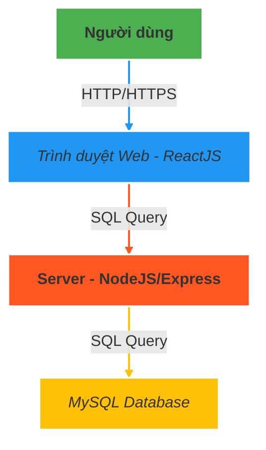

```mermaid
flowchart TD
    A[<b>Người dùng</b>] -->|HTTP/HTTPS| B[<i>Trình duyệt Web - ReactJS</i>]
    B -->|SQL Query| C[<b>Server - NodeJS/Express</b>]
    C -->|SQL Query| D[<i>MySQL Database</i>]
    
    %% Style
    style A fill:#4CAF50,stroke:#ffffff,stroke-width:2px;
    style B fill:#2196F3,stroke:#ffffff,stroke-width:2px;
    style C fill:#FF5722,stroke:#ffffff,stroke-width:2px;
    style D fill:#FFC107,stroke:#ffffff,stroke-width:2px;

    classDef boxStyle fill:#f0f0f0,stroke:#000000,stroke-width:2px;
    class A,B,C,D boxStyle;

    %% Arrow styles
    linkStyle 0 stroke:#2196F3,stroke-width:2px;
    linkStyle 1 stroke:#FF5722,stroke-width:2px;
    linkStyle 2 stroke:#FFC107,stroke-width:2px;
```