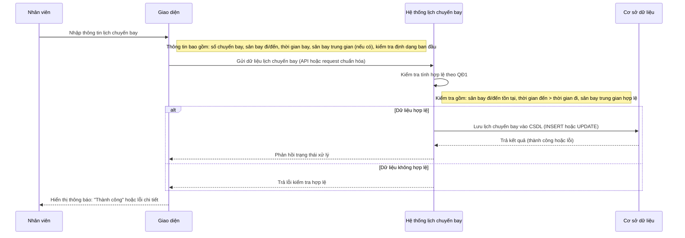

```mermaid
sequenceDiagram
    participant User as Nhân viên
    participant UI as Giao diện
    participant System as Hệ thống lịch chuyến bay
    participant DB as Cơ sở dữ liệu

    %% Step 1
    User->>UI: Nhập thông tin lịch chuyến bay
    Note right of UI: Thông tin bao gồm: số chuyến bay, sân bay đi/đến, thời gian bay, sân bay trung gian (nếu có), kiểm tra định dạng ban đầu

    %% Step 2
    UI->>System: Gửi dữ liệu lịch chuyến bay (API hoặc request chuẩn hóa)

    %% Step 3
    System->>System: Kiểm tra tính hợp lệ theo QĐ1
    Note right of System: Kiểm tra gồm: sân bay đi/đến tồn tại, thời gian đến > thời gian đi, sân bay trung gian hợp lệ

    %% Step 4
    alt Dữ liệu hợp lệ
        System->>DB: Lưu lịch chuyến bay vào CSDL (INSERT hoặc UPDATE)
        %% Step 5
        DB-->>System: Trả kết quả (thành công hoặc lỗi)
        %% Step 6
        System-->>UI: Phản hồi trạng thái xử lý
    else Dữ liệu không hợp lệ
        System-->>UI: Trả lỗi kiểm tra hợp lệ
    end

    %% Step 7
    UI-->>User: Hiển thị thông báo: "Thành công" hoặc lỗi chi tiết
```