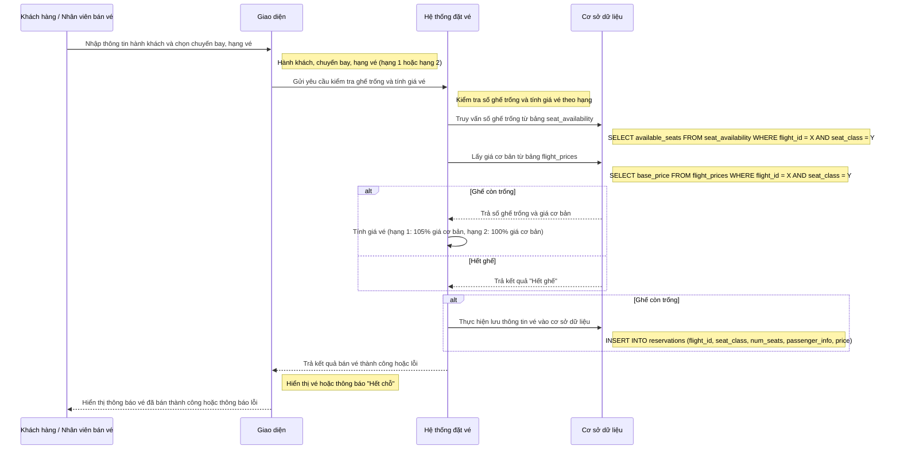

```mermaid
sequenceDiagram
    participant User as Khách hàng / Nhân viên bán vé
    participant UI as Giao diện
    participant BookingSystem as Hệ thống đặt vé
    participant DB as Cơ sở dữ liệu

    %% Step 1
    User->>UI: Nhập thông tin hành khách và chọn chuyến bay, hạng vé
    Note right of UI: Hành khách, chuyến bay, hạng vé (hạng 1 hoặc hạng 2)

    %% Step 2
    UI->>BookingSystem: Gửi yêu cầu kiểm tra ghế trống và tính giá vé
    Note right of BookingSystem: Kiểm tra số ghế trống và tính giá vé theo hạng

    %% Step 3 - Kiểm tra ghế trống
    BookingSystem->>DB: Truy vấn số ghế trống từ bảng seat_availability
    Note right of DB: SELECT available_seats FROM seat_availability WHERE flight_id = X AND seat_class = Y

    %% Step 4 - Tính giá vé
    BookingSystem->>DB: Lấy giá cơ bản từ bảng flight_prices
    Note right of DB: SELECT base_price FROM flight_prices WHERE flight_id = X AND seat_class = Y

    %% Step 5 - Kiểm tra số ghế và tính giá
    alt Ghế còn trống
        DB-->>BookingSystem: Trả số ghế trống và giá cơ bản
        BookingSystem->>BookingSystem: Tính giá vé (hạng 1: 105% giá cơ bản, hạng 2: 100% giá cơ bản)
    else Hết ghế
        DB-->>BookingSystem: Trả kết quả "Hết ghế"
    end

    %% Step 6 - Lưu vé
    alt Ghế còn trống
        BookingSystem->>DB: Thực hiện lưu thông tin vé vào cơ sở dữ liệu
        Note right of DB: INSERT INTO reservations (flight_id, seat_class, num_seats, passenger_info, price)
    end

    %% Step 7 - Trả kết quả
    BookingSystem-->>UI: Trả kết quả bán vé thành công hoặc lỗi
    Note right of UI: Hiển thị vé hoặc thông báo "Hết chỗ"

    %% Step 8
    UI-->>User: Hiển thị thông báo vé đã bán thành công hoặc thông báo lỗi
```