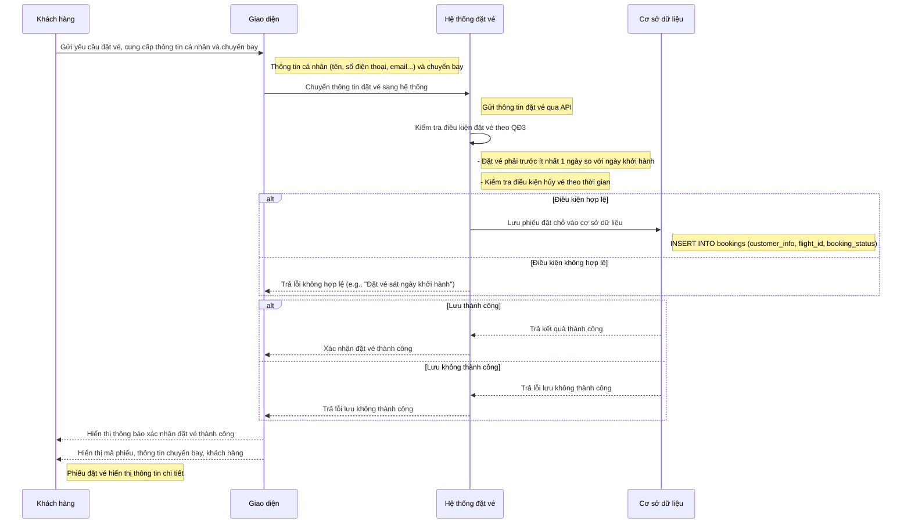

```mermaid
sequenceDiagram
    participant Customer as Khách hàng
    participant UI as Giao diện
    participant BookingSystem as Hệ thống đặt vé
    participant DB as Cơ sở dữ liệu

    %% Step 1
    Customer->>UI: Gửi yêu cầu đặt vé, cung cấp thông tin cá nhân và chuyến bay
    Note right of UI: Thông tin cá nhân (tên, số điện thoại, email...) và chuyến bay

    %% Step 2
    UI->>BookingSystem: Chuyển thông tin đặt vé sang hệ thống
    Note right of BookingSystem: Gửi thông tin đặt vé qua API

    %% Step 3 - Kiểm tra điều kiện đặt vé theo QĐ3
    BookingSystem->>BookingSystem: Kiểm tra điều kiện đặt vé theo QĐ3
    Note right of BookingSystem: - Đặt vé phải trước ít nhất 1 ngày so với ngày khởi hành
    Note right of BookingSystem: - Kiểm tra điều kiện hủy vé theo thời gian

    %% Step 4 - Lưu phiếu đặt chỗ vào cơ sở dữ liệu
    alt Điều kiện hợp lệ
        BookingSystem->>DB: Lưu phiếu đặt chỗ vào cơ sở dữ liệu
        Note right of DB: INSERT INTO bookings (customer_info, flight_id, booking_status)
    else Điều kiện không hợp lệ
        BookingSystem-->>UI: Trả lỗi không hợp lệ (e.g., "Đặt vé sát ngày khởi hành")
    end

    %% Step 5 - Trả kết quả lưu thành công hoặc lỗi
    alt Lưu thành công
        DB-->>BookingSystem: Trả kết quả thành công
        BookingSystem-->>UI: Xác nhận đặt vé thành công
    else Lưu không thành công
        DB-->>BookingSystem: Trả lỗi lưu không thành công
        BookingSystem-->>UI: Trả lỗi lưu không thành công
    end

    %% Step 6 - Gửi phản hồi xác nhận đặt vé thành công
    UI-->>Customer: Hiển thị thông báo xác nhận đặt vé thành công

    %% Step 7 - Hiển thị phiếu đặt chỗ cho khách hàng
    UI-->>Customer: Hiển thị mã phiếu, thông tin chuyến bay, khách hàng
    Note right of Customer: Phiếu đặt vé hiển thị thông tin chi tiết
```