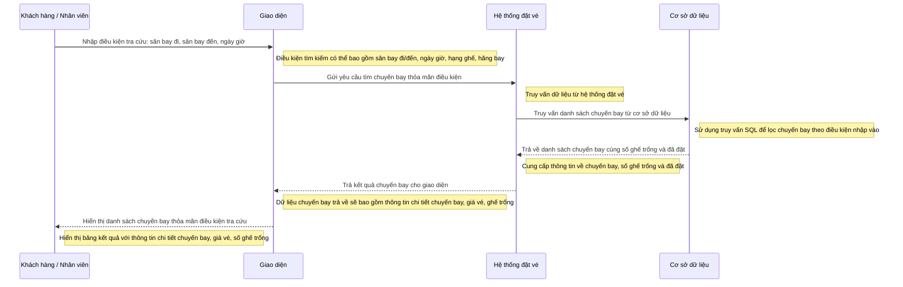

```mermaid
sequenceDiagram
    participant User as Khách hàng / Nhân viên
    participant UI as Giao diện
    participant BookingSystem as Hệ thống đặt vé
    participant DB as Cơ sở dữ liệu

    %% Step 1
    User->>UI: Nhập điều kiện tra cứu: sân bay đi, sân bay đến, ngày giờ
    Note right of UI: Điều kiện tìm kiếm có thể bao gồm sân bay đi/đến, ngày giờ, hạng ghế, hãng bay

    %% Step 2
    UI->>BookingSystem: Gửi yêu cầu tìm chuyến bay thỏa mãn điều kiện
    Note right of BookingSystem: Truy vấn dữ liệu từ hệ thống đặt vé

    %% Step 3
    BookingSystem->>DB: Truy vấn danh sách chuyến bay từ cơ sở dữ liệu
    Note right of DB: Sử dụng truy vấn SQL để lọc chuyến bay theo điều kiện nhập vào

    %% Step 4
    DB-->>BookingSystem: Trả về danh sách chuyến bay cùng số ghế trống và đã đặt
    Note right of BookingSystem: Cung cấp thông tin về chuyến bay, số ghế trống và đã đặt

    %% Step 5
    BookingSystem-->>UI: Trả kết quả chuyến bay cho giao diện
    Note right of UI: Dữ liệu chuyến bay trả về sẽ bao gồm thông tin chi tiết chuyến bay, giá vé, ghế trống

    %% Step 6
    UI-->>User: Hiển thị danh sách chuyến bay thỏa mãn điều kiện tra cứu
    Note right of User: Hiển thị bảng kết quả với thông tin chi tiết chuyến bay, giá vé, số ghế trống
```