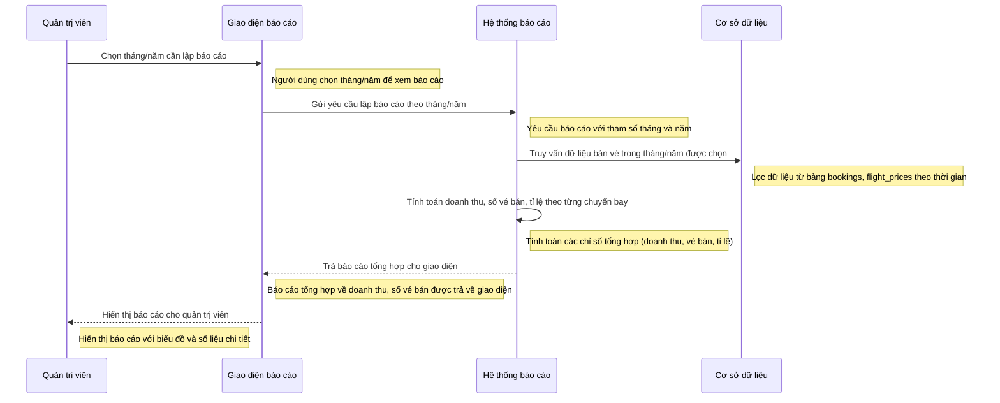

```mermaid
sequenceDiagram
    participant Admin as Quản trị viên
    participant ReportUI as Giao diện báo cáo
    participant ReportSystem as Hệ thống báo cáo
    participant DB as Cơ sở dữ liệu

    %% Step 1
    Admin->>ReportUI: Chọn tháng/năm cần lập báo cáo
    Note right of ReportUI: Người dùng chọn tháng/năm để xem báo cáo

    %% Step 2
    ReportUI->>ReportSystem: Gửi yêu cầu lập báo cáo theo tháng/năm
    Note right of ReportSystem: Yêu cầu báo cáo với tham số tháng và năm

    %% Step 3
    ReportSystem->>DB: Truy vấn dữ liệu bán vé trong tháng/năm được chọn
    Note right of DB: Lọc dữ liệu từ bảng bookings, flight_prices theo thời gian

    %% Step 4
    ReportSystem->>ReportSystem: Tính toán doanh thu, số vé bán, tỉ lệ theo từng chuyến bay
    Note right of ReportSystem: Tính toán các chỉ số tổng hợp (doanh thu, vé bán, tỉ lệ)

    %% Step 5
    ReportSystem-->>ReportUI: Trả báo cáo tổng hợp cho giao diện
    Note right of ReportUI: Báo cáo tổng hợp về doanh thu, số vé bán được trả về giao diện

    %% Step 6
    ReportUI-->>Admin: Hiển thị báo cáo cho quản trị viên
    Note right of Admin: Hiển thị báo cáo với biểu đồ và số liệu chi tiết
```