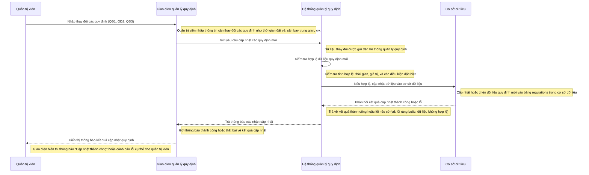

```mermaid
sequenceDiagram
    participant Admin as Quản trị viên
    participant RegUI as Giao diện quản lý quy định
    participant RegSystem as Hệ thống quản lý quy định
    participant DB as Cơ sở dữ liệu

    %% Step 1
    Admin->>RegUI: Nhập thay đổi các quy định (QĐ1, QĐ2, QĐ3)
    Note right of RegUI: Quản trị viên nhập thông tin cần thay đổi các quy định như thời gian đặt vé, sân bay trung gian, v.v.

    %% Step 2
    RegUI->>RegSystem: Gửi yêu cầu cập nhật các quy định mới
    Note right of RegSystem: Dữ liệu thay đổi được gửi đến hệ thống quản lý quy định

    %% Step 3
    RegSystem->>RegSystem: Kiểm tra hợp lệ dữ liệu quy định mới
    Note right of RegSystem: Kiểm tra tính hợp lệ: thời gian, giá trị, và các điều kiện đặc biệt

    %% Step 4
    RegSystem->>DB: Nếu hợp lệ, cập nhật dữ liệu vào cơ sở dữ liệu
    Note right of DB: Cập nhật hoặc chèn dữ liệu quy định mới vào bảng regulations trong cơ sở dữ liệu

    %% Step 5
    DB-->>RegSystem: Phản hồi kết quả cập nhật thành công hoặc lỗi
    Note right of RegSystem: Trả về kết quả thành công hoặc lỗi nếu có (vd: lỗi ràng buộc, dữ liệu không hợp lệ)

    %% Step 6
    RegSystem-->>RegUI: Trả thông báo xác nhận cập nhật
    Note right of RegUI: Gửi thông báo thành công hoặc thất bại về kết quả cập nhật

    %% Step 7
    RegUI-->>Admin: Hiển thị thông báo kết quả cập nhật quy định
    Note right of Admin: Giao diện hiển thị thông báo "Cập nhật thành công" hoặc cảnh báo lỗi cụ thể cho quản trị viên
```