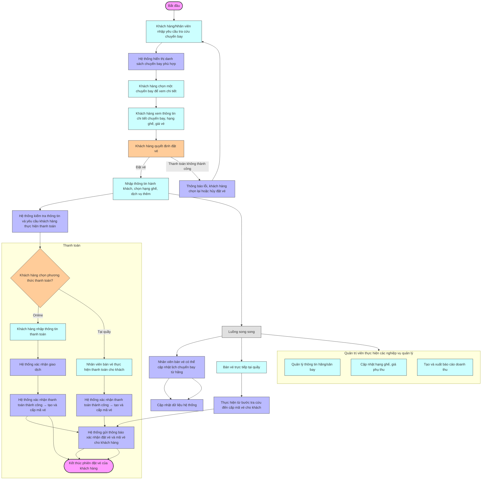

```mermaid
flowchart TD
    %% Định nghĩa các lớp node
    classDef startEnd fill:#f9f,stroke:#333,stroke-width:2px
    classDef action fill:#cff,stroke:#333
    classDef decision fill:#fc9,stroke:#333
    classDef process fill:#bbf,stroke:#333
    classDef parallel fill:#e0e0e0,stroke:#333,stroke-width:1px

    %% Start
    A([Bắt đầu]):::startEnd --> B[Khách hàng/Nhân viên nhập yêu cầu tra cứu chuyến bay]:::action
    B --> C[Hệ thống hiển thị danh sách chuyến bay phù hợp]:::process
    C --> D[Khách hàng chọn một chuyến bay để xem chi tiết]:::action
    D --> E[Khách hàng xem thông tin chi tiết chuyến bay, hạng ghế, giá vé]:::action
    E --> F[Khách hàng quyết định đặt vé]:::decision

    F -- Đặt vé --> G[Nhập thông tin hành khách, chọn hạng ghế, dịch vụ thêm]:::action
    G --> H[Hệ thống kiểm tra thông tin và yêu cầu khách hàng thực hiện thanh toán]:::process
    H --> I{Khách hàng chọn phương thức thanh toán?}:::decision

    %% Subgraph: Thanh toán
    subgraph ThanhToan["Thanh toán"]
        direction TB
        I -- Online --> J[Khách hàng nhập thông tin thanh toán]:::action
        J --> K[Hệ thống xác nhận giao dịch]:::process
        K --> L[Hệ thống xác nhận thanh toán thành công → tạo và cấp mã vé]:::process
        L --> M[Hệ thống gửi thông báo xác nhận đặt vé và mã vé cho khách hàng]:::process
        M --> Z([Kết thúc phiên đặt vé của khách hàng]):::startEnd

        I -- Tại quầy --> N[Nhân viên bán vé thực hiện thanh toán cho khách]:::action
        N --> O[Hệ thống xác nhận thanh toán thành công → tạo và cấp mã vé]:::process
        O --> M
    end

    %% Luồng song song
    P[Luồng song song]:::parallel
    G --> P
    P --> Q[Nhân viên bán vé có thể cập nhật lịch chuyến bay từ hãng]:::process
    Q --> R[Cập nhật dữ liệu hệ thống]:::process
    P --> S[Bán vé trực tiếp tại quầy]:::action
    S --> T[Thực hiện từ bước tra cứu đến cấp mã vé cho khách]:::process

    %% Subgraph: Quản trị viên nghiệp vụ
    subgraph QuanTriVien["Quản trị viên thực hiện các nghiệp vụ quản lý"]
        direction TB
        V[Quản lý thông tin hãng/sân bay]:::action
        W[Cập nhật hạng ghế, giá phụ thu]:::action
        X[Tạo và xuất báo cáo doanh thu]:::action
    end
    P --> QuanTriVien

    %% Điều kiện/Quy tắc nghiệp vụ
    F -- Thanh toán không thành công --> Y[Thông báo lỗi, khách hàng chọn lại hoặc hủy đặt vé]:::process
    Y --> B
    L --> Z
    M --> Z
    Q --> R
    T --> M
```