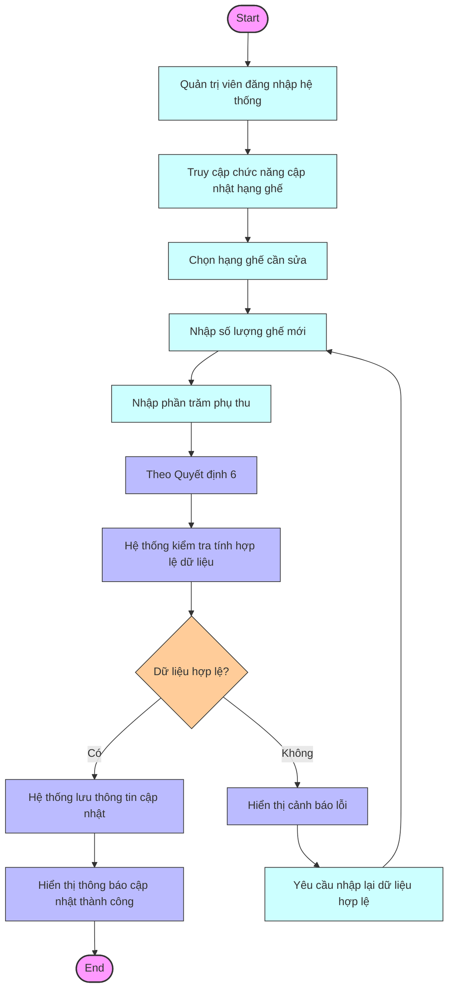

```mermaid
flowchart TD
    %% Định nghĩa các lớp node
    classDef startEnd fill:#f9f,stroke:#333,stroke-width:2px
    classDef action fill:#cff,stroke:#333
    classDef decision fill:#fc9,stroke:#333
    classDef process fill:#bbf,stroke:#333

    A([Start]):::startEnd --> B[Quản trị viên đăng nhập hệ thống]:::action
    B --> C[Truy cập chức năng cập nhật hạng ghế]:::action
    C --> D[Chọn hạng ghế cần sửa]:::action
    D --> E[Nhập số lượng ghế mới]:::action
    E --> F[Nhập phần trăm phụ thu]:::action
    F --> G[Theo Quyết định 6]:::process
    G --> H[Hệ thống kiểm tra tính hợp lệ dữ liệu]:::process
    H --> I{Dữ liệu hợp lệ?}:::decision

    I -- Có --> J[Hệ thống lưu thông tin cập nhật]:::process
    J --> K[Hiển thị thông báo cập nhật thành công]:::process
    K --> Z([End]):::startEnd

    I -- Không --> L[Hiển thị cảnh báo lỗi]:::process
    L --> M[Yêu cầu nhập lại dữ liệu hợp lệ]:::action
    M --> E
```