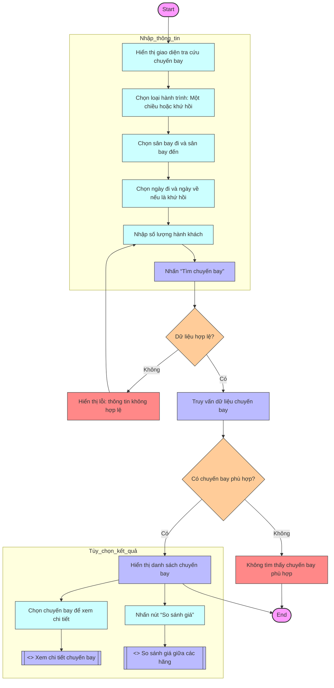

```mermaid
flowchart TD
    %% Kiểu node
    classDef startEnd fill:#f9f,stroke:#333,stroke-width:2px
    classDef input fill:#cff,stroke:#333
    classDef process fill:#bbf,stroke:#333
    classDef decision fill:#fc9,stroke:#333
    classDef error fill:#f88,stroke:#333

    A([Start]):::startEnd --> B[Hiển thị giao diện tra cứu chuyến bay]:::input

    subgraph Nhập_thông_tin
        B --> C[Chọn loại hành trình: Một chiều hoặc khứ hồi]:::input
        C --> D[Chọn sân bay đi và sân bay đến]:::input
        D --> E[Chọn ngày đi và ngày về nếu là khứ hồi]:::input
        E --> F[Nhập số lượng hành khách]:::input
        F --> G[Nhấn “Tìm chuyến bay”]:::process
    end

    G --> H{Dữ liệu hợp lệ?}:::decision

    H -- "Không" --> H1[Hiển thị lỗi: thông tin không hợp lệ]:::error
    H1 --> F

    H -- "Có" --> I[Truy vấn dữ liệu chuyến bay]:::process

    I --> J{Có chuyến bay phù hợp?}:::decision

    J -- "Không" --> J1[Không tìm thấy chuyến bay phù hợp]:::error
    J1 --> Z([End]):::startEnd

    J -- "Có" --> K[Hiển thị danh sách chuyến bay]:::process

    subgraph Tùy_chọn_kết_quả
        K --> L[Chọn chuyến bay để xem chi tiết]:::input
        L --> M[[<<include>> Xem chi tiết chuyến bay]]:::process

        K --> N[Nhấn nút “So sánh giá”]:::input
        N --> O[[<<extend>> So sánh giá giữa các hãng]]:::process
    end

    K --> Z([End]):::startEnd
```