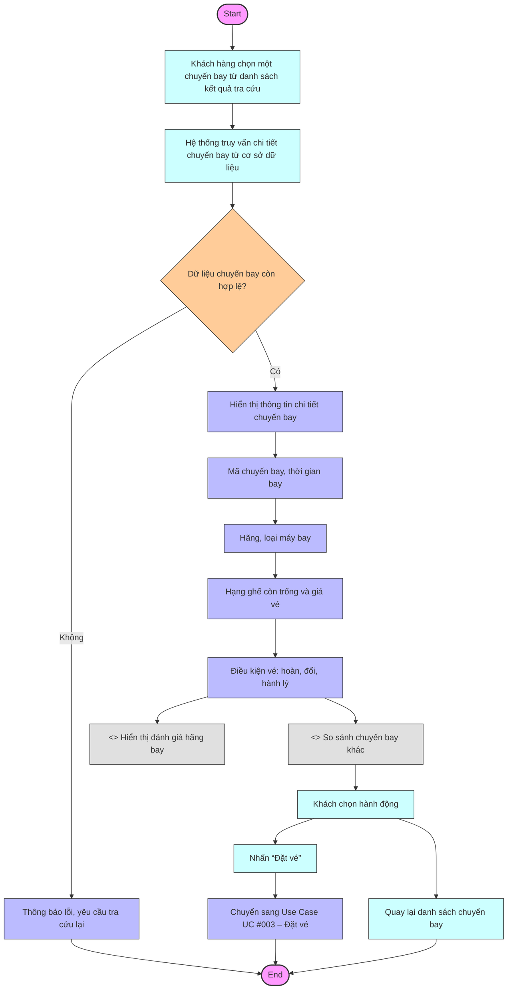

```mermaid
flowchart TD
    %% Định nghĩa các lớp node
    classDef startEnd fill:#f9f,stroke:#333,stroke-width:2px
    classDef action fill:#cff,stroke:#333
    classDef decision fill:#fc9,stroke:#333
    classDef process fill:#bbf,stroke:#333
    classDef extend fill:#e0e0e0,stroke:#333,stroke-width:1px

    A([Start]):::startEnd --> B[Khách hàng chọn một chuyến bay từ danh sách kết quả tra cứu]:::action
    B --> C[Hệ thống truy vấn chi tiết chuyến bay từ cơ sở dữ liệu]:::action
    C --> D{Dữ liệu chuyến bay còn hợp lệ?}:::decision

    D -- Không --> E[Thông báo lỗi, yêu cầu tra cứu lại]:::process
    E --> Z([End]):::startEnd

    D -- Có --> F[Hiển thị thông tin chi tiết chuyến bay]:::process
    F --> G[Mã chuyến bay, thời gian bay]:::process
    G --> H[Hãng, loại máy bay]:::process
    H --> I[Hạng ghế còn trống và giá vé]:::process
    I --> J[Điều kiện vé: hoàn, đổi, hành lý]:::process
    J --> K[<<extend>> So sánh chuyến bay khác]:::extend
    J --> L[<<extend>> Hiển thị đánh giá hãng bay]:::extend
    K --> M[Khách chọn hành động]:::action
    M --> N[Nhấn “Đặt vé”]:::action
    N --> O[Chuyển sang Use Case UC #003 – Đặt vé]:::process
    M --> P[Quay lại danh sách chuyến bay]:::action
    O --> Z([End]):::startEnd
    P --> Z([End]):::startEnd
```