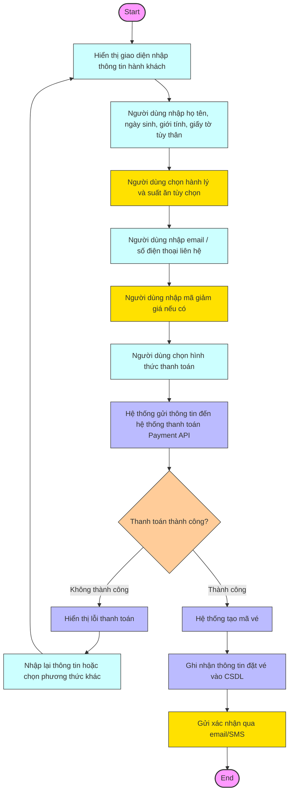

```mermaid
flowchart TD
    %% Định nghĩa các lớp node
    classDef startEnd fill:#f9f,stroke:#333,stroke-width:2px
    classDef action fill:#cff,stroke:#333
    classDef decision fill:#fc9,stroke:#333
    classDef process fill:#bbf,stroke:#333
    classDef extend fill:#ffe100,stroke:#333,stroke-width:1px

    A([Start]):::startEnd --> B[Hiển thị giao diện nhập thông tin hành khách]:::action
    B --> C[Người dùng nhập họ tên, ngày sinh, giới tính, giấy tờ tùy thân]:::action
    C --> D[Người dùng chọn hành lý và suất ăn tùy chọn]:::extend
    D --> E[Người dùng nhập email / số điện thoại liên hệ]:::action
    E --> F[Người dùng nhập mã giảm giá nếu có]:::extend
    F --> G[Người dùng chọn hình thức thanh toán]:::action
    G --> H[Hệ thống gửi thông tin đến hệ thống thanh toán Payment API]:::process

    H --> I{Thanh toán thành công?}:::decision
    I -- Không thành công --> J[Hiển thị lỗi thanh toán]:::process
    J --> K[Nhập lại thông tin hoặc chọn phương thức khác]:::action
    K --> B

    I -- Thành công --> L[Hệ thống tạo mã vé]:::process
    L --> M[Ghi nhận thông tin đặt vé vào CSDL]:::process
    M --> N[Gửi xác nhận qua email/SMS]:::extend
    N --> Z([End]):::startEnd
```