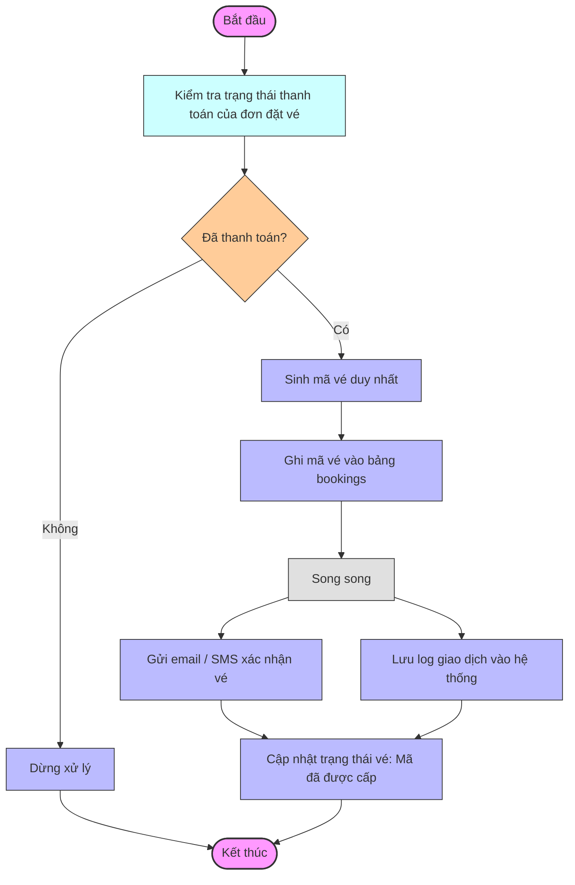

```mermaid
flowchart TD
    %% Định nghĩa các lớp node
    classDef startEnd fill:#f9f,stroke:#333,stroke-width:2px
    classDef action fill:#cff,stroke:#333
    classDef decision fill:#fc9,stroke:#333
    classDef process fill:#bbf,stroke:#333
    classDef parallel fill:#e0e0e0,stroke:#333,stroke-width:1px

    A([Bắt đầu]):::startEnd --> B[Kiểm tra trạng thái thanh toán của đơn đặt vé]:::action
    B --> C{Đã thanh toán?}:::decision

    C -- Không --> D[Dừng xử lý]:::process
    D --> Z([Kết thúc]):::startEnd

    C -- Có --> E[Sinh mã vé duy nhất]:::process
    E --> F[Ghi mã vé vào bảng bookings]:::process
    F --> G[Song song]:::parallel

    G --> H[Gửi email / SMS xác nhận vé]:::process
    G --> I[Lưu log giao dịch vào hệ thống]:::process

    H --> J[Cập nhật trạng thái vé: Mã đã được cấp]:::process
    I --> J
    J --> Z([Kết thúc]):::startEnd
```