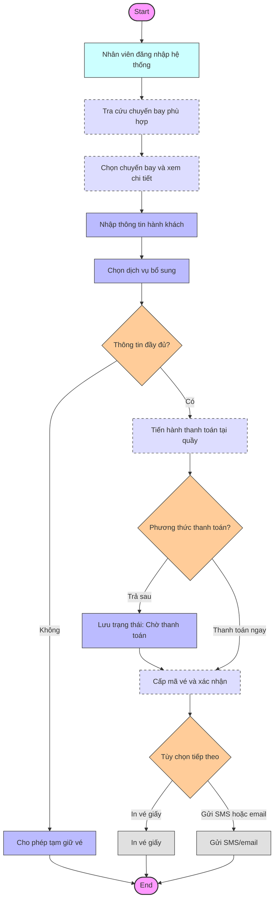

```mermaid
flowchart TD
    %% Định nghĩa các lớp node
    classDef startEnd fill:#f9f,stroke:#333,stroke-width:2px
    classDef action fill:#cff,stroke:#333
    classDef decision fill:#fc9,stroke:#333
    classDef process fill:#bbf,stroke:#333
    classDef optional fill:#e0e0e0,stroke:#333,stroke-width:1px
    classDef include fill:#ddf,stroke:#333,stroke-dasharray: 5 5

    A([Start]):::startEnd --> B[Nhân viên đăng nhập hệ thống]:::action
    B --> C[Tra cứu chuyến bay phù hợp]:::include
    C --> D[Chọn chuyến bay và xem chi tiết]:::include
    D --> E[Nhập thông tin hành khách]:::process
    E --> F[Chọn dịch vụ bổ sung]:::process
    F --> G{Thông tin đầy đủ?}:::decision

    G -- Không --> H[Cho phép tạm giữ vé]:::process --> Z([End]):::startEnd

    G -- Có --> I[Tiến hành thanh toán tại quầy]:::include
    I --> J{Phương thức thanh toán?}:::decision
    J -- Trả sau --> K[Lưu trạng thái: Chờ thanh toán]:::process --> L[Cấp mã vé và xác nhận]:::include
    J -- Thanh toán ngay --> L
    L --> M{Tùy chọn tiếp theo}:::decision
    M -- In vé giấy --> N[In vé giấy]:::optional
    M -- Gửi SMS hoặc email --> O[Gửi SMS/email]:::optional
    N --> Z
    O --> Z
```