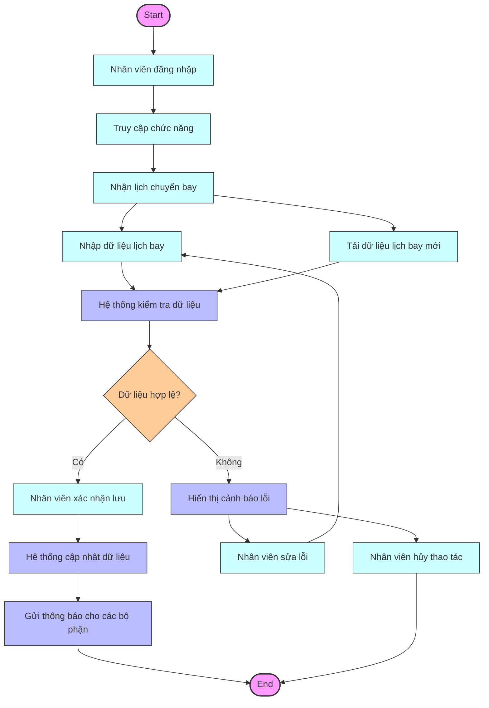

```mermaid
flowchart TD
    %% Định nghĩa các lớp node
    classDef startEnd fill:#f9f,stroke:#333,stroke-width:2px
    classDef action fill:#cff,stroke:#333
    classDef decision fill:#fc9,stroke:#333
    classDef process fill:#bbf,stroke:#333

    A([Start]):::startEnd --> B[Nhân viên đăng nhập]:::action
    B --> C[Truy cập chức năng]:::action
    C --> D[Nhận lịch chuyến bay]:::action
    D --> E[Nhập dữ liệu lịch bay]:::action
    D --> F[Tải dữ liệu lịch bay mới]:::action

    E --> G[Hệ thống kiểm tra dữ liệu]:::process
    F --> G

    G --> H{Dữ liệu hợp lệ?}:::decision

    H -- Có --> I[Nhân viên xác nhận lưu]:::action
    I --> J[Hệ thống cập nhật dữ liệu]:::process
    J --> K[Gửi thông báo cho các bộ phận]:::process
    K --> Z([End]):::startEnd

    H -- Không --> L[Hiển thị cảnh báo lỗi]:::process
    L --> M[Nhân viên sửa lỗi]:::action
    L --> N[Nhân viên hủy thao tác]:::action
    M --> E
    N --> Z
```