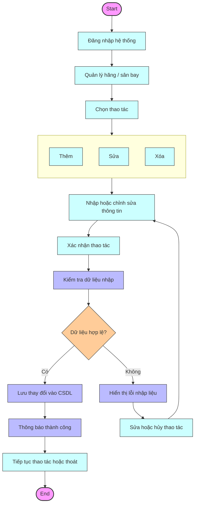

```mermaid
flowchart TD
    %% Định nghĩa các lớp node
    classDef startEnd fill:#f9f,stroke:#333,stroke-width:2px
    classDef action fill:#cff,stroke:#333
    classDef decision fill:#fc9,stroke:#333
    classDef process fill:#bbf,stroke:#333

    A([Start]):::startEnd --> B[Đăng nhập hệ thống]:::action
    B --> C[Quản lý hãng / sân bay]:::action
    C --> D[Chọn thao tác]:::action

    subgraph thaoTac [ ]
        direction TB
        D1[Thêm]:::action
        D2[Sửa]:::action
        D3[Xóa]:::action
    end
    D --> thaoTac

    thaoTac --> E[Nhập hoặc chỉnh sửa thông tin]:::action
    E --> F[Xác nhận thao tác]:::action
    F --> G[Kiểm tra dữ liệu nhập]:::process
    G --> H{Dữ liệu hợp lệ?}:::decision

    H -- Có --> I[Lưu thay đổi vào CSDL]:::process
    I --> J[Thông báo thành công]:::process
    J --> K[Tiếp tục thao tác hoặc thoát]:::action
    K --> Z([End]):::startEnd

    H -- Không --> M[Hiển thị lỗi nhập liệu]:::process
    M --> N[Sửa hoặc hủy thao tác]:::action
    N --> E

```