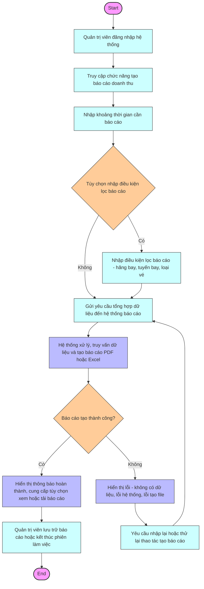

```mermaid
flowchart TD
    %% Định nghĩa các lớp node
    classDef startEnd fill:#f9f,stroke:#333,stroke-width:2px
    classDef action fill:#cff,stroke:#333
    classDef decision fill:#fc9,stroke:#333
    classDef process fill:#bbf,stroke:#333

    A([Start]):::startEnd --> B[Quản trị viên đăng nhập hệ thống]:::action
    B --> C[Truy cập chức năng tạo báo cáo doanh thu]:::action
    C --> D[Nhập khoảng thời gian cần báo cáo]:::action
    D --> E{Tùy chọn nhập điều kiện lọc báo cáo}:::decision
    E -- Có --> F[Nhập điều kiện lọc báo cáo - hãng bay, tuyến bay, loại vé]:::action
    E -- Không --> G[Gửi yêu cầu tổng hợp dữ liệu đến hệ thống báo cáo]:::action
    F --> G

    G --> H[Hệ thống xử lý, truy vấn dữ liệu và tạo báo cáo PDF hoặc Excel]:::process
    H --> I{Báo cáo tạo thành công?}:::decision

    I -- Có --> J[Hiển thị thông báo hoàn thành, cung cấp tùy chọn xem hoặc tải báo cáo]:::process
    J --> K[Quản trị viên lưu trữ báo cáo hoặc kết thúc phiên làm việc]:::action
    K --> Z([End]):::startEnd

    I -- Không --> L[Hiển thị lỗi - không có dữ liệu, lỗi hệ thống, lỗi tạo file]:::process
    L --> M[Yêu cầu nhập lại hoặc thử lại thao tác tạo báo cáo]:::action
    M --> G
```